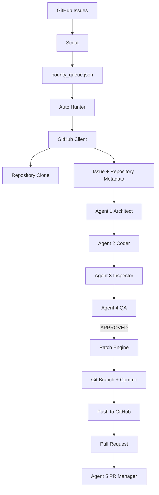

# System Architecture

## Components

- **Scout:** discovers candidate issues.
- **Auto Hunter:** manages the queue and execution timeout/status.
- **GitHub Client:** handles GitHub API calls, repository cloning, Git operations, and Pull Requests.
- **BountyHunterAPI:** wraps Gemini API calls and exposes the five agent roles.
- **Patch Engine:** applies only unambiguous SEARCH/REPLACE blocks.
- **Config:** loads environment configuration without storing secrets in source code.

The design uses modular components so GitHub operations, AI operations, configuration, patching, and orchestration can be tested or changed independently.
