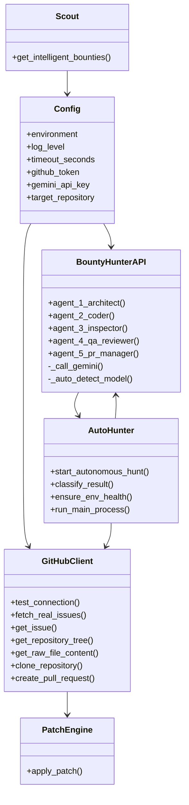

# Class / Component Diagram

```mermaid
classDiagram
    class Config {
        +environment
        +log_level
        +timeout_seconds
        +github_token
        +gemini_api_key
        +target_repository
    }

    class BountyHunterAPI {
        +agent_1_architect()
        +agent_2_coder()
        +agent_3_inspector()
        +agent_4_qa_reviewer()
        +agent_5_pr_manager()
        -_call_gemini()
        -_auto_detect_model()
    }

    class GitHubClient {
        +test_connection()
        +fetch_real_issues()
        +get_issue()
        +get_repository_tree()
        +get_raw_file_content()
        +clone_repository()
        +create_pull_request()
    }

    class Scout {
        +get_intelligent_bounties()
    }

    class AutoHunter {
        +start_autonomous_hunt()
        +classify_result()
        +ensure_env_health()
        +run_main_process()
    }

    class PatchEngine {
        +apply_patch()
    }

    Config --> BountyHunterAPI
    Config --> GitHubClient
    Scout --> Config
    AutoHunter --> BountyHunterAPI
    AutoHunter --> GitHubClient
    GitHubClient --> PatchEngine
    BountyHunterAPI --> AutoHunter
```
