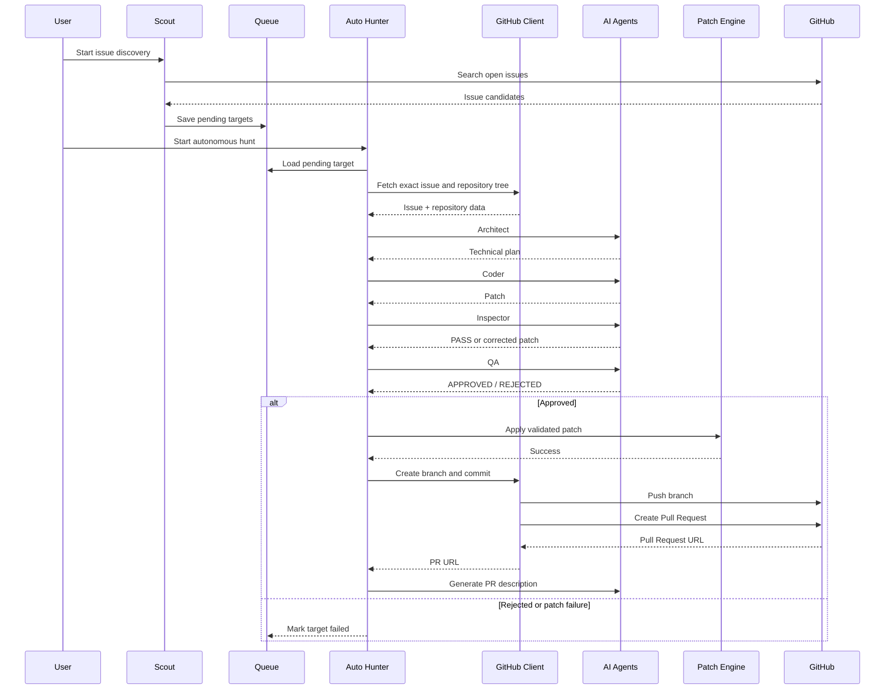

# Sequence Diagram

```mermaid
sequenceDiagram
    participant User
    participant Scout
    participant Queue
    participant Hunter as Auto Hunter
    participant GH as GitHub Client
    participant AI as AI Agents
    participant Patch as Patch Engine
    participant GitHub

    User->>Scout: Start issue discovery
    Scout->>GitHub: Search open issues
    GitHub-->>Scout: Issue candidates
    Scout->>Queue: Save pending targets

    User->>Hunter: Start autonomous hunt
    Hunter->>Queue: Load pending target
    Hunter->>GH: Fetch exact issue and repository tree
    GH-->>Hunter: Issue + repository data

    Hunter->>AI: Architect
    AI-->>Hunter: Technical plan
    Hunter->>AI: Coder
    AI-->>Hunter: Patch
    Hunter->>AI: Inspector
    AI-->>Hunter: PASS or corrected patch
    Hunter->>AI: QA
    AI-->>Hunter: APPROVED / REJECTED

    alt Approved
        Hunter->>Patch: Apply validated patch
        Patch-->>Hunter: Success
        Hunter->>GH: Create branch and commit
        GH->>GitHub: Push branch
        GH->>GitHub: Create Pull Request
        GitHub-->>GH: Pull Request URL
        GH-->>Hunter: PR URL
        Hunter->>AI: Generate PR description
    else Rejected or patch failure
        Hunter-->>Queue: Mark target failed
    end
```
