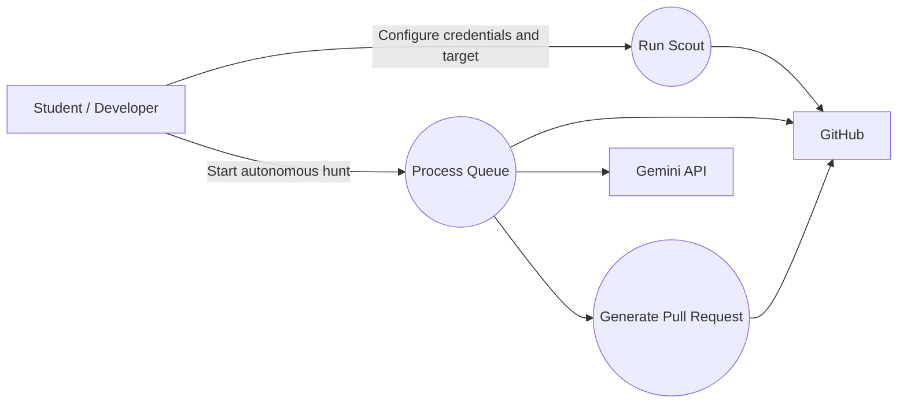

# Use Case Diagram

## Main use cases

- Configure the system.
- Discover candidate bounty issues.
- Process a queued issue.
- Analyze and generate a patch.
- Validate and apply the patch.
- Create a Git branch, commit, and Pull Request.
