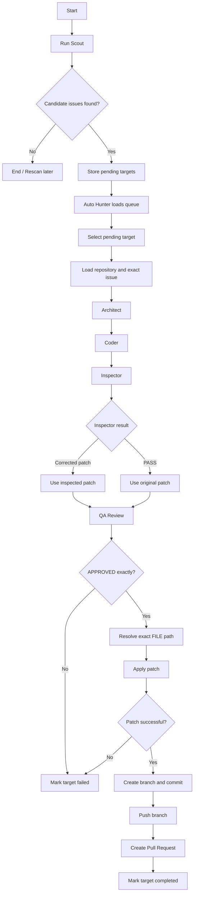

# Process Workflow

```mermaid
flowchart TD
    A[Start] --> B[Run Scout]
    B --> C{Candidate issues found?}
    C -- No --> D[End / Rescan later]
    C -- Yes --> E[Store pending targets]
    E --> F[Auto Hunter loads queue]
    F --> G[Select pending target]
    G --> H[Load repository and exact issue]
    H --> I[Architect]
    I --> J[Coder]
    J --> K[Inspector]
    K --> L{Inspector result}
    L -- Corrected patch --> M[Use inspected patch]
    L -- PASS --> N[Use original patch]
    M --> O[QA Review]
    N --> O
    O --> P{APPROVED exactly?}
    P -- No --> Q[Mark target failed]
    P -- Yes --> R[Resolve exact FILE path]
    R --> S[Apply patch]
    S --> T{Patch successful?}
    T -- No --> Q
    T -- Yes --> U[Create branch and commit]
    U --> V[Push branch]
    V --> W[Create Pull Request]
    W --> X[Mark target completed]
```

The queue is updated after each target so a failure does not become a successful completion.
